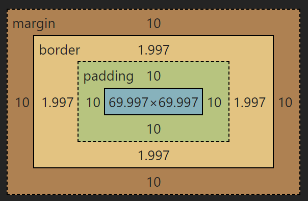

# HTML.note

- [README.md](../README.md)
- [JavaScript.note](JavaScript.note.md)
- [大杂烩](root/sample.html)

[TOC]

# HTML 关键字缩写

- 参考字典：[HTML 元素参考](https://developer.mozilla.org/zh-CN/docs/Web/HTML/Element)

|    HTML 标签     |         英文全称          |            中文释义            |
| :--------------: | :-----------------------: | :----------------------------: |
|      `<a>`       |          Anchor           |               锚               |
|     `<abbr>`     |       Abbreviation        |             缩写词             |
|   `<acronym>`    |          Acronym          |        取首字母的缩写词        |
|   `<address>`    |          Address          |              地址              |
|     `<dfn>`      | Defines a Definition Term |          定义定义条目          |
|     `<kbd>`      |         Keyboard          |          键盘（文本）          |
|     `<samp>`     |          Sample           |           示例（文本           |
|     `<var>`      |         Variable          |          变量（文本）          |
|      `<tt>`      |         Teletype          |         打印机（文本）         |
|     `<code>`     |           Code            |         源代码（文本）         |
|     `<pre>`      |       Preformatted        |       预定义格式（文本）       |
|  `<blockquote>`  |      Block Quotation      |           区块引用语           |
|     `<cite>`     |         Citation          |              引用              |
|      `<q>`       |         Quotation         |             引用语             |
|    `<strong>`    |          Strong           |          加重（文本）          |
|      `<em>`      |        Emphasized         |          加重（文本）          |
|      `<b>`       |           Bold            |          粗体（文本）          |
|      `<i>`       |          Italic           |          斜体（文本）          |
|     `<big>`      |            Big            |          变大（文本）          |
|    `<small>`     |           Small           |          变小（文本）          |
|     `<sup>`      |       Superscripted       |          上标（文本）          |
|     `<sub>`      |        Subscripted        |          下标（文本）          |
|     `<bdo>`      | Direction of Text Display |          文本显示方向          |
|      `<br>`      |           Break           |              换行              |
|    `<center>`    |         Centered          |          居中（文本）          |
|     `<font>`     |           Font            |              字体              |
|      `<u>`       |        Underlined         |         下划线（文本）         |
| `<s>`/`<strike>` |      Strike through       |             删除线             |
|     `<div>`      |         Division          |              分隔              |
|     `<span>`     |           Span            |              范围              |
|      `<ol>`      |          Ordered          |            排序列表            |
|      `<ul>`      |      Unordered List       |           不排序列表           |
|      `<li>`      |         List Item         |            列表项目            |
|      `<dl>`      |      Definition List      |            定义列表            |
|      `<dt>`      |      Definition Term      |            定义术语            |
|      `<dd>`      |  Definition Description   |            定义描述            |
|     `<del>`      |          Deleted          |         删除（的文本）         |
|     `<ins>`      |         Inserted          |         插入（的文本）         |
|  `<h1>`~`<h6>`   |   Header 1 to Header 6    |        标题 1 到标题 6         |
|      `<p>`       |         Paragraph         |              段落              |
|      `<hr>`      |      Horizontal Rule      |             水平尺             |
|     `<href>`     |    hypertext reference    |           超文本引用           |
|     `<alt>`      |           alter           | 替用(一般是图片显示不出的提示) |
|     `<src>`      |          Source           |           源文件链接           |
|     `<cell>`     |           cell            |               巢               |
| `<cellpadding>`  |        cellpadding        |             巢补白             |
| `<cellspacing>`  |        cellspacing        |             巢空间             |
|      `<nl>`      |     navigation lists      |            导航列表            |
|      `<tr>`      |         table row         |          表格中的一行          |
|      `<th>`      |     table header cell     |          表格中的表头          |
|      `<td>`      |      table data cell      |       表格中的一个单元格       |
|    `<iframe>`    |       Inline frame        |          定义内联框架          |
|   `<optgroup>`   |       Option group        |           定义选项组           |
|       ` `        |           空格            |            `&nbsp;`            |
|       `<`        |          小于号           |             `&lt;`             |
|       `>`        |          大于号           |             `&gt;`             |
|       `&`        |           和号            |            `&amp;`             |
|       `"`        |           引号            |            `&quot;`            |
|       `'`        |           撇号            |      `&apos;` (IE 不支持)      |

# CSS

<br>

## 字体基础

- `line-height`，行间距，默认 1.2 ，当行间距等于盒子高度时，就可以使文字**垂直居中**
- `font-weight`，字重(粗细)，加粗：`bold`，细：`height`
- `font-size`，字体大小，默认 16px, 最小是 12px
- `font-family: "fangsong";`，字体样式
- `text-decoration`，下划线类型
- `text-indent` ： 第一行文字缩进长度
- `text-shadow` 设置文本阴影
- `text-transform` 控制元素中的字母
- `text-align` , 文字对齐方式
  - `left` ：行内内容向左侧边对齐。
  - `right` ：行内内容向右侧边对齐。
  - `center` ：行内内容**水平居中**。
  - `justify` ：文字向两侧对齐，对最后一行无效。
  - `justify-all` ：和 justify 一致，但是强制使最后一行两端对齐。
- `direction` 设置文本方向。
- `letter-spacing` 设置字符间距
- `unicode-bidi` 设置或返回文本是否被重写
- `vertical-align` 设置元素的**垂直对齐**
- `white-space` 设置元素中空白的处理方式
- `word-spacing` 设置字间距
- `color`，字体颜色值

<br>

## 图片

- `opacity` , 透明度
- `object-fit` , 调整内容长宽比 属性可接受如下值：
  - `fill` - 默认值。调整替换后的内容大小，以填充元素的内容框。如有必要，将拉伸或挤压物体以适应该对象。
  - `contain` - 缩放替换后的内容以保持其纵横比，同时将其放入元素的内容框。
  - `cover` - 调整替换内容的大小，以在填充元素的整个内容框时保持其长宽比。该对象将被裁剪以适应。
  - `none` - 不对替换的内容调整大小。
  - `scale-down` - 调整内容大小就像没有指定内容或包含内容一样（将导致较小的具体对象尺寸）

<br>

## 盒子

- `border-radius` , 圆角半径
- `margin` , 外边距
  - 当只指定一个值时，该值会统一应用到**全部四个边**的外边距上。
  - 指定两个值时，第一个值会应用于**上边和下边**的外边距，第二个值应用于**左边和右边**。
  - 指定三个值时，第一个值应用于**上边**，第二个值应用于**右边和左边**，第三个则应用于**下边**的外边距。
  - 指定四个值时，依次（**顺时针方向**）作为上边，右边，下边，和左边的外边距。
  - 也可以单是 `margin-right`来指定
  - **居中**则是 `margin`的`left`和`right`为 **`auto`**，且同时元素的**宽是确定**的
- `padding` , 内边距
- `height`、`width` , 宽高
- 但是，如图 完整的框是指 长：`width + 2\*(margin + padding + border)`
  <br>
- 而用了 **`box-sizing: border-box;`** 后，边距不影响宽度了（放全局）

<br>

## 列表

- 下列是对 `list-style` 属性的常见属性值的描述：
  - `none`：不使用项目符号
  - `disc`：实心圆
  - `circle`：空心圆
  - `square`：实心方块
  - `decimal`：阿拉伯数字
  - `lower-alpha`：小写英文字母
  - `upper-alpha`：大写英文字母
  - `lower-roman`：小写罗马数字
  - `upper-roman`：大写罗马数字

<br>

## 组合选择与继承

- `div p {xxx}` ，是指以`div`父项的所有**子孙项**`p`的样式都受 xxx 影响
- `div>p {}` ，只有`div`的直接**子项**`p`才算，而孙项的`p`不受影响：`in html： <div><span><p>`
- `div+p{}` ，拥有**共同父项**的`div`和`p`（兄弟项），且`p`位于`div`下的**第一项**，`p`的样式才受影响；这时`div`的**子项**`p`不受影响
- `div~p{}` ，所有与`div`互为兄弟关系的`p`都受样式影响
- 但还有 **属性选择器**：
  - `input[type="text"] {}` ：类型为 `input` 且是`text`的样式受影响
  - 自定义属性：如 `<div data-123="texts"></div>` `->` `div[data-123] {}`

<br>

## 伪类与伪元素

- **伪类**

  - `：link` 超链接点击之前
  - `：visited` 链接被访问过之后
    - 但 `a`标签涵盖了`link`、`visited`的状态
  - `：hover` “悬停”：鼠标放到标签上的时候
  - `：active` “激活”： 鼠标点击标签，但是不松手时。
  - `：focus` 是某个标签获得焦点时的样式（比如某个输入框获得焦点）

- **伪元素**
  - `：first-letter` 选择每个元素的第一个字母
  - `：first-line` 选择每个元素的第一行
  - `：first-child` 选择器匹配属于任意元素的第一个**子元素**
  - `：before` 在每个元素之前插入内容
  - `：after` 在每个元素之后插入内容 (通常配合`:hover`)

<br>

## 布局方式

### flex 弹性

#### 定义

&emsp;&emsp; 基于一维的布局。只要给`flex`元素的父元素声明 `display： flex` ，默认地所有子元素就会排成一行，且自动分配小大以充分展示元素的内容。所以是，**在父元素定义 `flex`，然后再在子元素再定义下列属性**

#### 子元素的分布

- **`flex-direction`**：默认为`row` 水平排列，`column`为竖直排列。`flex-wrap`：溢出时自动换行换行。
  - 可以将两个属性 `flex-direction` 和 `flex-wrap` 组合为简写属性 `flex-flow`。第一个指定的值为 `flex-direction` ，第二个指定的值为 `flex-wrap`.
- **`flex-grow`**：元素放大比例。值为 0 或 正整数(按比例分配多余的空间)
- **`flex-shrink`**：元素缩小比例。值为 1 或 0；
- **`flex-basic`**：设置子元素初始化大小，给上面两个属性分配多余空间之前，计算项目是否有多余空间，默认值为 auto,即项目本身的大小
- （可简写：`flex: grow shrink basic`）

#### 子元素对齐方式

- **`align-items`**： 属性可以使元素在**交叉轴**方向对齐。这个属性的初始值为`stretch`。
  - 可分为：`center`、`flex-start`、`flex-end`、`stretch`(在交叉轴上撑满整个父元素)、`baseline`(基于内容基线)
- **`justify-content`** ： 属性用来使元素在**主轴**方向上对齐，主轴方向是通过`flex-direction` 设置的方向。初始值是`flex-start`。
  - 可分 为：`center`、`flex-start`、`flex-end`、`stretch`、`space-around`(元素之间的距离相等)、`space-between`(元素左右的空间相等、贴边)
- **`align-content`**：当 `flex-wrap：wrap*` 时(即 子元素 换行排列)，控制 子元素 在 cross axis(**交叉轴**)上的对齐方式。
- **`align-self`**：单独的对齐方式

### grid 网格

### float 浮动

- 创建：`float: left | right | none (默认值) | inherit (继承父元素的浮动属性)`
- 清除：`clear: left | right | both`

### position 定位

- 静态定位(`Static` positioning)是每个元素默认的属性——它表示“将元素放在文档布局流的默认位置——没有什么特殊的地方”。
- 相对定位(`Relative` positioning)允许我们相对于元素在正常的文档流中的位置移动它——包括将两个元素叠放在页面上。
- 绝对定位(`Absolute` positioning)将元素完全从页面的正常布局流中移出，类似将它单独放在一个图层中。我们可以将元素相对于页面的 `<html>` 元素边缘固定，或者相对于该元素的**最近被定位祖先元素**。
- 固定定位(`Fixed` positioning)与绝对定位非常类似，但是它是将一个元素相对浏览器视口固定，而不是相对另外一个元素。
- 粘性定位(`Sticky` positioning) 当元素移动到预设位置时遍黏住似的固定住。

### column 多列布局

- `column-count: number`：列数
- `column-gap: number`：列间间隔
- `column-rule: style color`：间隔样式，同`border`
- `column-width: number`：列宽

### 参考链接

- [flex 与 grid 区别](https://juejin.cn/post/6940627375537258527#heading-9)
- [CSS flex 布局](http://www.ruanyifeng.com/blog/2015/07/flex-grammar.html)

<br>

## transition 过渡

- `transition-property` 指定使用过渡效果的 css 属性
- `transition-duration` 设置过渡动画持续时间
- `transition-timing-function` 设置动画的时间函数。
  - `liner` ：匀速
  - `ease-in`：减速
  - `ease-out`：加速
  - `ease-in-out`：先加速再减速
  - `cubic-bezier`：三次贝塞尔曲线，[可以定制](http://cubic-bezier.com)
- `transition-delay` 设置动画的延迟时间
- 简写：`transition: 属性 持续 函数 延迟`
- transition 的优点在于简单易用，但是它有几个很大的局限。
  1. 需要事件触发，所以没法在网页加载时自动发生。
  2. 是一次性的，不能重复发生，除非一再触发。
  3. 只能定义开始状态和结束状态，不能定义中间状态，也就是说只有两个状态。
  4. 规则，只能定义一个属性的变化，不能涉及多个属性。
- [深入理解 transition](https://www.cnblogs.com/xiaohuochai/p/5347930.html)

#### 可过渡的样式

```css
颜色: color background-color border-color outline-color
位置: background-position left right top bottom
长度:
    [1]max-height min-height max-width min-width height width
    [2]border-width margin padding outline-width outline-offset
    [3]font-size line-height text-indent vertical-align
    [4]border-spacing letter-spacing word-spacing
数字: opacity visibility z-index font-weight zoom
组合: text-shadow transform box-shadow clip
其他: gradient
```

## animation 动画

- `animation-name`：none 为默认值，将没有任何动画效果，其可以用来覆盖任何动画
- `animation-duration`：默认值为 0，意味着动画周期为 0，也就是没有任何动画效果
- `animation-timing-function`：与 `transition-timing-function` 一样
- `animation-delay`：在开始执行动画时需要等待的时间
- `animation-iteration-count`：定义动画的播放次数，默认为 1，如果为 `infinite`，则无限次循环播放
- `animation-direction`：动画播放方向
  - 默认为 `normal`，每次循环都是向前播放，（0-100）
  - 另一个值为 `alternate`，动画播放为偶数次则向前播放，如果为基数词就反方向播放
- `animation-state`：动画播放状态
  - 默认为 `running`，播放
  - `paused`，暂停
- `animation-fill-mode`：定义动画开始之前和结束之后发生的操作.
  - 默认值为 `none`，动画结束时回到动画没开始时的状态
  - `forwards`，动画结束后继续应用最后关键帧的位置，即保存在结束状态
  - `backwards`，让动画回到第一帧的状态
  - `both`：轮流应用 `forwards` 和 `backwards` 规则。
- 简写： `animation: duration | timing-function | delay | iteration-count | direction | fill-mode | play-state | name`

#### 关键帧 @keyframes + name

&emsp;&emsp;在 animation 申明 name 后，再另写关键帧动画样式
