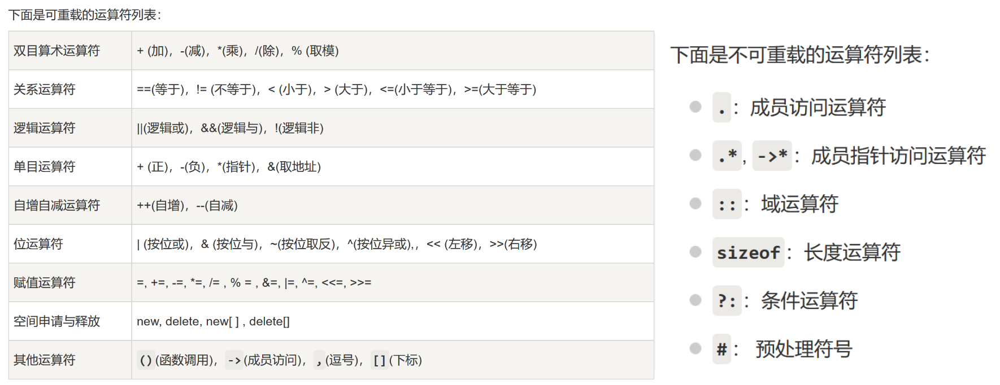

<p style="font-size: 40px; color: #fff"><b>C / C++</b></p>

- **[README.md](../README.md)**
- **[算 法](Algorithm/Main.md)**

[TOC]

<br><br>

# 一些小语法

## 命名规范

**[编程语言中常用的变量命名缩写](https://blog.csdn.net/qq_37851620/article/details/94731227)**

## 缓冲区

**[C++ cin 详解及清空输入缓冲区](https://blog.csdn.net/selina8921/article/details/79067941)**

## stringstream

- **[C++ stringstream 介绍](https://www.cnblogs.com/wuchanming/p/3906176.html)**

- `getline` 与 `ss`
  ```C++ {.line-numbers}
      string s; int m; map<string, int> guo;
      getline(cin, s);
      stringstream ss;
      ss << s;
      while (ss >> s >> m)
          guo[s] += m;
  ```

## 模板 template

- **[C++模板 template 用法总结](https://blog.csdn.net/qq_35637562/article/details/55194097)**

  ```C++ {.line-numbers}
  template <class T>  //单个类型
  T big(T x, T y)
  {
      return x > y ? x : y;
  }
  template <class T1, class T2>  //不同类型
  inline const T2 Max(const T1 a, const T2 b)
  {
      return a > b ? a : b;
  }
  ```

  ```C++ {.line-numbers}
  template <class out_type, class in_value>
  out_type transf(const in_value &t)
  {
    stringstream stream; out_type result;
    stream << t, stream >> result, stream.sync();
    return result;
  }
  int main()
  {
    string s = "532";
    double t = transf<double>(s); // <>里的是要转换的类型名，()里的是被转换的变量名
  }
  ```

<br>

## 结构体

- **初始化结构体：**
  ```C++ {.line-numbers}
  struct node
  {
    ll a, b, c;
    node()
    {
      memset(this, 0, sizeof(node));
    }
  };
  ```

<br>

## Class 类

### 定义类

- **访问权限：**

  - `public`：**任何地方** 都能访问
  - `private`：只能被 **类内访问**，被继承的子孙类都没法访问
  - `protected`：只能被 类内或被继承的子孙类 访问，构造的类不能访问。
    > 其实就是 不想放到 public 里但又想让子孙类访问，于是就有了 protected
  - `const` 限定：const 定义的类只能访问 类内的变量 _或_ 父类的非 private 的变量 _和_ 被 const 修饰的函数
  - `static` 静态：只能在静态的函数、变量、类之间访问，非静态定义的不能访问。使用不了 `this` 指针

- 与结构体类似，但是默认是以 `Private` 构造的。偏向 **数据结构** 的是结构体，偏向 **对象** 的是类

### 构造类

- **构造函数：** 是指在定义类的时候就运行了。带参数时即给变量赋值。用法：
  ```C++ {.line-numbers}
  class mie
  {
  private:
      int aha;
  public:
      mie(int x) { this->aha = x; }
      mie(int x) : aha(x) {} //或
      void print() { cout << this->aha << endl; }
  };
  // 用法：
  mie m(12); m.print(); // 12
  ```
- **析构函数：** 是在删除对象时(或运行结束)时运行，有助于在跳出程序（比如关闭文件、释放内存等）前释放资源。
- **拷贝构造函数：** 即为在初定义时赋值。与定义后再赋值不同，那时需要 **重载** 等于号才能赋值。

  ```C++ {.line-numbers}
  class mie
  {
  public:
      int num;
      mie(int x) : num(x){};
      mie(const mie &m) { this->num = m.num; }
  };
  // 用：
  mie m(123);  mie mm = m;
  ```

  > Ref：[拷贝构造函数\_知乎](https://zhuanlan.zhihu.com/p/157833251)

- **友元：** 加上 `friend` 就可以有权访问 **任何** 成员。且能防止什么都放到 `public` 里，还能节省开支。**但是：**
  1. 友元关系 **不能被继承**；
  2. 友元关系是 **单向的**，不具有交换性。即类 B 是类 A 的友元，则类 A 不一定是类 B 的友元，需要看类中是否有相应的声明；
  3. 友元关系 **不具有传递性**。即类 B 是类 A 的友元，类 C 是类 B 的友元，但类 C 不一定是类 A 的友元，需要看类中是否有相应的声明。
  4. 另外，使用一般不建议把整个类声明为友元类，而只将某些成员函数声明为友元函数，这样更安全些。

### 继承

- **概念：** 在定义一个新的类 B 时，如果该类与某个已有的类 A 相似（指的是 B 拥有 A 的全部特点），那么就可以把 A 作为一个基类，而把 B 作为基类的一个派生类（也称子类）。
- **格式：**
  ```C++ {.line-numbers}
  class son : public | private | protected father{};
  ```
- **权限：** 继承方式 是用来指明父类成员在子类中的 **最高访问权限** 的
- 一个派生类继承了所有的基类方法，但下列情况除外：
  - 基类的构造函数、析构函数和拷贝构造函数
  - 基类的重载运算符
  - 基类的友元函数

> Ref: [C++ 继承\_简书](https://www.jianshu.com/p/1b661fbc8fb4)

### 重载

- **重载运算符：**
- 
- **一元运算符：** 如负号、自增自减
  ```C++ {.line-numbers}
  Stu operator++() // 前缀自增：++mie;
  {
      score++;
      return *this;
  }
  Stu operator++(int) // 后缀自增：mie++: 带参数且与被加数类型相等
  {
      ++*this;
      return *this;
  }
  ```
-

<br><br>

# C 語言中に

1.  数组长度：

    ```C++ {.line-numbers}
    int len = sizeof(b)/sizeof(int);
    ```

2.  `memset` 批量赋值只能是 `char` 用，`int` 只能给 -1 或 0， 而：

    ```C++ {.line-numbers}
    memset(a, 127, sizeof(a))   //赋值无穷大
    memset(a, 128, sizeof(a))   //赋值无穷小
    ```

3.  `ctime`

    - 时间戳获取与转换
      ```C++ {.line-numbers}
      time_t t = time(0);
      // cin >> t; //当然，也能输入时间戳（秒）
      char tmp[32] = {}, form[] = "%Y-%m-%d %H:%M:%S";
      strftime(tmp, sizeof(tmp), form, localtime(&t));
      cout << tmp << endl;
      ```
    - 当前时间
      ```C++ {.line-numbers}
      time_t t = time(&t);
      string s = ctime(&t);
      cout << s << endl;
      ```

4.  符号优先级

    - 
