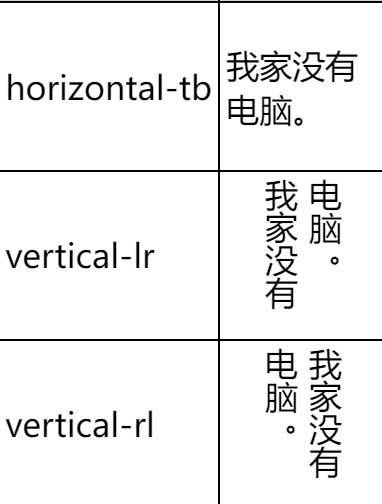
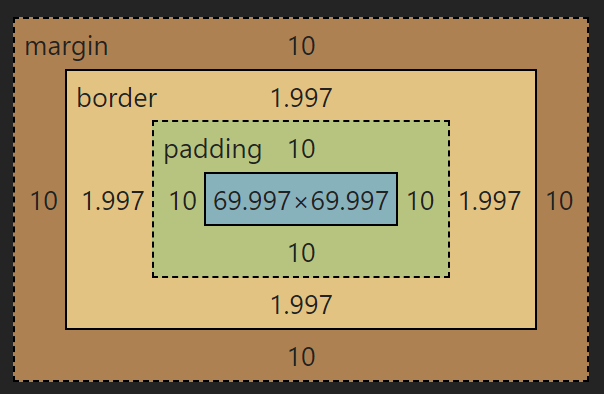
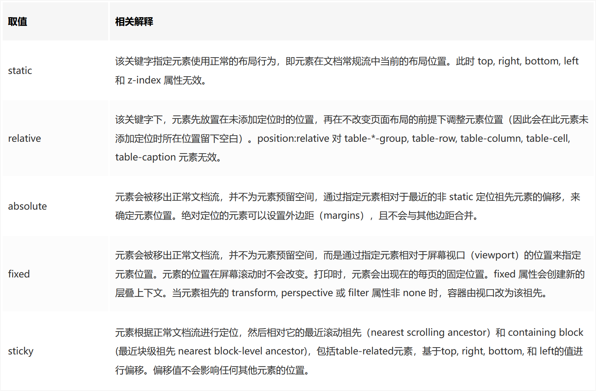

  <h1 align="center"><b>CSS</b></h1><br>

- [README](README.md)
- [HTML](HTML.md)

[TOC]

## 字体

- `line-height`，行间距，默认 1.2 ，当行间距等于盒子高度时，就可以使文字**垂直居中**
- `font-weight: bold | hight`，字重(粗细)
- `font-size`，字体大小，默认 16px, 最小是 12px
- `font-family: "fangsong";`，字体样式
- `text-decoration`，下划线类型
- `text-indent` ： 第一行文字缩进长度
- `text-shadow` 设置文本阴影
- `text-transform` 控制元素中的字母
- `text-align: left | right | center | justify (文字向两侧对齐)` , 文字对齐方式
- `write-mode: horizontal-tb | vertical-rl | vertical-lr ` 文字书写方向
  - 
- `white-space` 设置元素中空白的处理方式
- `word-spacing` 设置单词间距
- `letter-spacing` 设置字母间距
- `color`，字体颜色值

<br>

## 单位

- **绝对长度:**
  - 绝对长度单位是固定的，用任何一个绝对长度表示的长度都将恰好显示为这个尺寸。
  - 不建议在屏幕上使用绝对长度单位，因为屏幕尺寸变化很大。但是，如果已知输出介质，则可以使用它们，例如用于打印布局（print layout）
    | 单位 | 描述 |
    | :--- | :--------- |
    | `cm` | 厘米 |
    | `mm` | 毫米 |
    | `in` | 英寸 (1in = 96px = 2.54cm) |
    | `px` | 像素 (1px = 1/96th of 1in) |
    | `pt` | 点 (1pt = 1/72 of 1in) |
  - **像素（px）** 是相对于观看设备的。对于低 dpi 的设备，1px 是显示器的一个设备像素（点）。对于打印机和高分辨率屏幕，1px 表示多个设备像素。
- **相对长度:**
  - 相对长度单位规定相对于另一个长度属性的长度。相对长度单位在不同渲染介质之间缩放表现得更好。
    | 单位 | 描述 |
    | :----- | :--- |
    | `em` | 相对于元素的字体大小（font-size）（2em 表示当前字体大小的 2 倍） |
    | `ex` | 相对于当前字体的 x-height(极少使用) |
    | `ch` | 相对于 "0"（零）的宽度 |
    | `rem` | 相对于根元素的字体大小（font-size） |
    | `vw` | 相对于视口\*宽度的 1% |
    | `vh` | 相对于视口\*高度的 1% |
    | `vmin` | 相对于视口\*较小尺寸的 1％ |
    | `vmax` | 相对于视口\*较大尺寸的 1％ |
    | `%` | 相对于父元素 |
  - 视口（Viewport）= 浏览器窗口的尺寸。如果视口宽 50 里面，则 1vw = 0.5cm。

<br>

## background

简写：`background: color | image | origin | position | repeat | size | attachment`

- `background-size: contain | cover | num`
  - `contain` 是缩放以填充盒子，并会 `repeat`
  - `cover` 是剪裁以填充盒子
  - 若为具体数值，百分比或长宽(拉伸), 则 `repeat` 填充盒子
- `background-attachment: scroll | fixed | local`
  - `scroll` 随整体滚动而不随图片内容
  - `fixed` 不随任何滚动
  - `local` 随图片内容而滚动

<br>

## 图片

- `opacity` , 透明度
- `object-fit` , 调整内容长宽比 属性可接受如下值：
  - `fill` - 默认值。调整替换后的内容大小，以填充元素的内容框。如有必要，将拉伸或挤压物体以适应该对象。
  - `contain` - 缩放替换后的内容以保持其纵横比，同时将其放入元素的内容框。
  - `cover` - 调整替换内容的大小，以在填充元素的整个内容框时保持其长宽比。该对象将被裁剪以适应。
  - `none` - 不对替换的内容调整大小。
  - `scale-down` - 调整内容大小就像没有指定内容或包含内容一样（将导致较小的具体对象尺寸）

<br>

## 盒子

- `border-radius` , 圆角半径
- `margin` , 外边距
  - 当只指定一个值时，该值会统一应用到**全部四个边**的外边距上。
  - 指定两个值时，第一个值会应用于**上边和下边**的外边距，第二个值应用于**左边和右边**。
  - 指定三个值时，第一个值应用于**上边**，第二个值应用于**右边和左边**，第三个则应用于**下边**的外边距。
  - 指定四个值时，依次（**顺时针方向**）作为上边，右边，下边，和左边的外边距。
  - 也可以单是 `margin-right`来指定
  - **居中**则是 `margin`的`left`和`right`为 **`auto`**，且同时元素的**宽是确定**的
- `padding` , 内边距
- `height`、`width` , 宽高
- 但是，如图 完整的框是指 长：`width + 2\*(margin + padding + border)`
  
- 而用了 **`box-sizing: border-box;`** 后，边距不影响宽度了（放全局）

<br>

## 列表

- 下列是对 `list-style` 属性的常见属性值的描述：
  - `none`：不使用项目符号
  - `disc`：实心圆
  - `circle`：空心圆
  - `square`：实心方块
  - `decimal`：阿拉伯数字
  - `lower-alpha`：小写英文字母
  - `upper-alpha`：大写英文字母
  - `lower-roman`：小写罗马数字
  - `upper-roman`：大写罗马数字

<br>

## 选择器

### 组合选择与继承

- `.class1.class2` ，同时包含这两个 class 的元素
- `div p {xxx}` ，是指以`div`父项的所有**子孙项**`p`的样式都受 xxx 影响
- `div>p {}` ，只有`div`的直接**子项**`p`才算，而孙项的`p`不受影响：`in html： <div><span><p>`
- `div+p{}` ，拥有**共同父项**的`div`和`p`（兄弟项），且`p`位于`div`下的**第一项**，`p`的样式才受影响；这时`div`的**子项**`p`不受影响
- `div~p{}` ，所有与`div`互为兄弟关系的`p`都受样式影响
- 但还有 **属性选择器**：
  - `input[type="text"] {}` ：类型为 `input` 且是`text`的样式受影响
  - 自定义属性：如 `<div data-123="texts"></div>` `->` `div[data-123] {}`
  - 指定
    <table><tbody><tr><th >选择器</th><th>例子</th><th>例子描述</th></tr><tr><td><code>[<i>attribute</i>]</code></td><td>[target]</td><td>选择带有target属性的所有元素。</td></tr><tr><td><code>[<i>attribute</i>=<i>value</i>]</code></td><td>[target=_blank]</td><td>选择带有target="_blank"属性的所有元素。</td></tr><tr><td><code>[<i>attribute</i>~=<i>value</i>]</code></td><td>[title~=flower]</td><td>选择title属性包含单词"flower"的所有元素。</td></tr><tr><td><code>[<i>attribute</i>|=<i>value</i>]</code></td><td>[lang|=en]</td><td>选择lang属性值以"en"开头的所有元素。</td></tr><tr><td><code>[<i>attribute</i>^=<i>value</i>]</code></td><td>a[href^="https"]</td><td>选择其src属性值以"https"开头的每个&lt;a&gt;元素。</td></tr><tr><td><code>[<i>attribute</i>$=<i>value</i>]</code></td><td>a[href$=".pdf"]</td><td>选择其src属性以".pdf"结尾的所有&lt;a&gt;元素。</td></tr><tr><td><code >[<i>attribute</i>*=<i>value</i>]</code></td><td>a[href*="abc"]</td><td>选择其href属性值中包含"abc"子串的每个&lt;a&gt;元素。</td></tr></tbody></table>

### 伪类与伪元素

#### 伪类

- **状态：**
  - `:link` 超链接点击之前
  - `:visited` 链接被访问过之后
    但 `a`标签涵盖了`link`、`visited`的状态
  - `:hover` “悬停”：鼠标放到标签上的时候
  - `:active` “激活”： 鼠标点击标签，但是不松手时。
  - `:focus` 是某个标签获得焦点时的样式（比如某个输入框获得焦点）
- **指定元素：**
  - `:not` 一个否定伪类，用于匹配不符合参数选择器的元素
  - `:first-child` 匹配元素的第一个子元素
  - `:last-child` 匹配元素的最后一个子元素
  - `:first-of-type` 表示一组兄弟元素中其类型的第一个元素
  - `:last-of-type` 表示一组兄弟元素中其类型的最后一个元素
  - `:nth-child` 根据元素的位置匹配一个或者多个元素，它接受一个 an+b 形式的参数
  - `:nth-last-child` 与`:nth-child` 相似，不同之处在于它从最后一个子元素开始计数
  - `:nth-of-type` 与 `nth-child` 相似，不同之处在于它是只匹配特定类型的元素
  - `:nth-last-type` 与 `nth-of-type` 相似，不同之处在于它是从最后一个子元素开始计数的。
  - `:only-child` 当元素是其父元素中唯一的子元素时，`:only-child` 匹配该元素
  - `:only-of-type` 当元素是其父元素中唯一特定类型的子元素时，`:only-child` 匹配该元素
  - `:target` 当 url 带有瞄名称，指向文档内某个具体的元素时`:target` 匹配该元素
- **表单：**
  - `:checked` 匹配被选中的 `input` 元素，这个 `input` 元素包裹 `radio` 和 `checkbox`.
  - `:default` 匹配默认选中的元素
  - `:disabled` 匹配禁用的表单元素
  - `:empty` 匹配没有子元素的元素，如果元素中含有文本节点，html 元素或者一个空格，则`:empty` 不能匹配这个元素
  - `:enabled` 匹配没有设置 disabled 属性的表单元素
  - `:in-range` 匹配在指定区域内元素，
  - `:out-of-range` 匹配不在指定区域内的元素
  - `:indetermimate` 当某组中的单选框或复选框还没有选取状态时，匹配该组中所有的单选框或复选框
  - `:valid` 匹配条件验证正确的表单元素
  - `:invalid` 匹配提交验证错误的表单元素
  - `:optional` `:required` 匹配设置有无设置 `required` 属性的表单元素
  - `:read-only` 匹配设置了只读属性的元素
  - `:read-write` 匹配处于编辑状态的元素
  - `:placeholder-shown` 当 `input` 设置了 `placeholder` 后，在用户输入前生效
- **其他：**
  - `:fullscreen` 全屏时触发

#### 伪元素

- `::first-letter` 选择每个元素的第一个字母
- `::first-line` 选择每个元素的第一行
- `::first-child` 选择器匹配属于任意元素的第一个**子元素**
- `::before` 在每个元素之前插入内容
- `::after` 在每个元素之后插入内容
- `::selection` 用户选中的部分

> Ref: [伪类与伪元素](http://www.alloyteam.com/2016/05/summary-of-pseudo-classes-and-pseudo-elements/)

<br>

## 布局方式

### flex 弹性

- **定义:**
  - 基于一维的布局。只要给`flex`元素的父元素声明 `display： flex` ，默认地所有子元素就会排成一行，且自动分配小大以充分展示元素的内容。所以是，**在父元素定义 `flex`，然后再在子元素再定义下列属性**
- **子元素的分布：**
  - `flex-direction`：默认为`row` 水平排列，`column`为竖直排列。`flex-wrap`：溢出时自动换行换行。
    - 可以将两个属性 `flex-direction` 和 `flex-wrap` 组合为简写属性 `flex-flow`。第一个指定的值为 `flex-direction` ，第二个指定的值为 `flex-wrap`.
  - `flex-grow`：元素放大比例。值为 0 或 正整数(按比例分配多余的空间)
  - `flex-shrink`：元素缩小比例。值为 1 或 0；
  - `flex-basic`：设置子元素初始化大小，给上面两个属性分配多余空间之前，计算项目是否有多余空间，默认值为 auto,即项目本身的大小
  - （可简写：`flex: grow shrink basic`）
- **子元素对齐方式：**
  - 要先定义父元素的长宽，子元素才会对齐
  - **`align-items`**： 属性可以使元素在**交叉轴**方向对齐。这个属性的初始值为`stretch`。
    - 可分为：`center`、`flex-start`、`flex-end`、`stretch`(在交叉轴上撑满整个父元素)、`baseline`(基于内容基线)
  - **`justify-content`** ： 属性用来使元素在**主轴**方向上对齐，主轴方向是通过`flex-direction` 设置的方向。初始值是`flex-start`。
    - 可分 为：`center`、`flex-start`、`flex-end`、`stretch`、`space-around`(元素之间的距离相等)、`space-between`(元素左右的空间相等、贴边)
  - **`align-content`**：当 `flex-wrap：wrap*` 时(即 子元素 换行排列)，控制 子元素 在 cross axis(**交叉轴**)上的对齐方式。
  - **`align-self`**：单独的对齐方式
- **另一种居中对齐：** 必须定义宽高才能 auto
  ```css {.line-numbers}
  .par {
    width: xx;
    height: xx;
    display: flex;
  }
  .child {
    width: xx;
    width: xx;
    margin: auto;
  }
  ```

<br>

### grid 网格

<br>

### float 浮动

- 创建：`float: left | right | none (默认值) | inherit (继承父元素的浮动属性)`
- 清除：`clear: left | right | both`

### position 定位

- `static` : **默认**的定位方式，没有特别的地方
- `relative` : **相对定位**，不添加偏移量则与 `static` 没差
- `absolute` : **绝对定位**，往上冒泡地找定位方式**不是 `static`**的祖先(父)元素，并相对于该元素绝对定位
- `fixed` : 相对于浏览器窗口固定
- `sticky` : **粘性定位**，当元素(滚动条)移动到预设位置时固定
- 

### column 多列布局

- `column-count: number`：列数
- `column-gap: number`：列间间隔
- `column-rule: style color`：间隔样式，同`border`
- `column-width: number`：列宽

> Ref: [flex 与 grid 区别](https://juejin.cn/post/6940627375537258527#heading-9) 、 [CSS flex 布局](http://www.ruanyifeng.com/blog/2015/07/flex-grammar.html)

<br>

## transition 过渡

- `transition-property` 指定使用过渡效果的 css 属性
- `transition-duration` 设置过渡动画持续时间
- `transition-timing-function` 设置动画的时间函数。
  - `liner` ：匀速
  - `ease-in`：减速
  - `ease-out`：加速
  - `ease-in-out`：先加速再减速
  - `cubic-bezier`：三次贝塞尔曲线，[可以定制](http://cubic-bezier.com)
- `transition-delay` 设置动画的延迟时间
- 简写：`transition: 属性 持续 函数 延迟`
- transition 的优点在于简单易用，但是它有几个很大的局限。
  1. 需要事件触发，所以没法在网页加载时自动发生。
  2. 是一次性的，不能重复发生，除非一再触发。
  3. 只能定义开始状态和结束状态，不能定义中间状态，也就是说只有两个状态。
  4. 规则，只能定义一个属性的变化，不能涉及多个属性。
- [深入理解 transition](https://www.cnblogs.com/xiaohuochai/p/5347930.html)

### 可过渡的样式

- 颜色: `color` `border-color` `outline-color`
- 位置: `position` `left` `right` `top` `bottom`
- 长度:
  - `height` `width`
  - `border-width` `margin` `padding` `outline-width`
  - `font-size` `line-height` `text-indent` `vertical-align`
  - `border-spacing` `letter-spacing` `word-spacing`
- 数字: `opacity` `visibility` `z-index` `font-weight` `zoom`
- 组合: `text-shadow` `transform` `box-shadow` `clip`
- 其他: `gradient`

### 过渡函数

- `scale(value)` : 用于修改元素的大小。可以通过向量形式定义的缩放值来放大或缩小元素，同时可以在不同的方向设置不同的缩放值。

<br>

## animation 动画

- `animation-name`：none 为默认值，将没有任何动画效果，其可以用来覆盖任何动画
- `animation-duration`：默认值为 0，意味着动画周期为 0，也就是没有任何动画效果
- `animation-timing-function`：与 `transition-timing-function` 一样
- `animation-delay`：在开始执行动画时需要等待的时间
- `animation-iteration-count`：定义动画的播放次数，默认为 1，如果为 `infinite`，则无限次循环播放
- `animation-direction`：动画播放方向
  - 默认为 `normal`，每次循环都是向前播放，（0-100）
  - 另一个值为 `alternate`，动画播放为偶数次则向前播放，如果为基数词就反方向播放
- `animation-state`：动画播放状态
  - 默认为 `running`，播放
  - `paused`，暂停
- `animation-fill-mode`：定义动画开始之前和结束之后发生的操作.
  - 默认值为 `none`，动画结束时回到动画没开始时的状态
  - `forwards`，动画结束后继续应用最后关键帧的位置，即保存在结束状态
  - `backwards`，让动画回到第一帧的状态
  - `both`：轮流应用 `forwards` 和 `backwards` 规则。
- 简写： `animation: duration | timing-function | delay | iteration-count | direction | fill-mode | play-state | name`

### 关键帧 @keyframes + name

&emsp;&emsp;在 animation 申明 name 后，再另写关键帧动画样式
