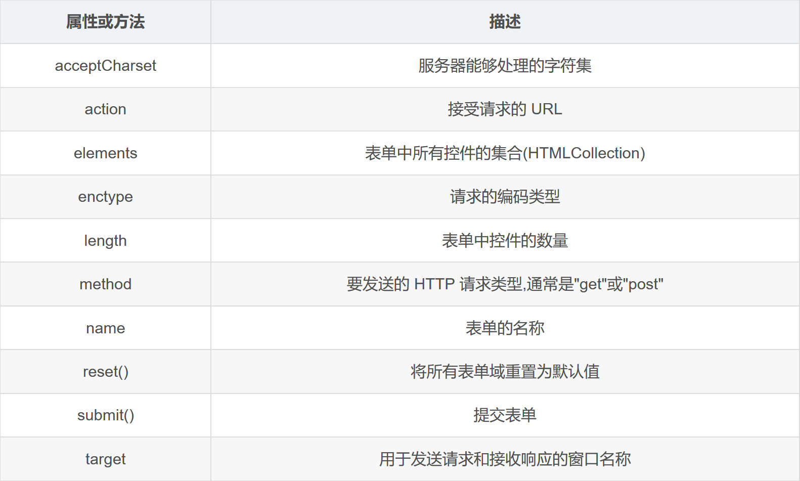
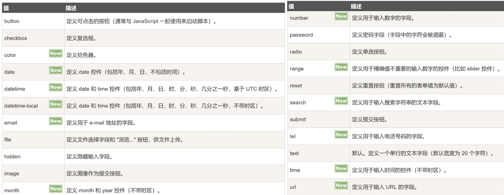

  <h1 align="center"><b>HTML</b></h1>

- [README](README.md)
- [CSS | Less](CSS.md)
- [JavaScript.md](JavaScript/JavaScript.md)
- [大杂烩](../../Web/sample.html)

[TOC]

<br><br>

## 关键字缩写


> 参考字典：[HTML 元素参考\_MDN ](https://developer.mozilla.org/zh-CN/docs/Web/HTML/Element)

<br>

## \<meta\> 文档级元数据元素

## Skipping

## 表单

### 概述

- 表单的属性和方法
- 

- **且：**

  - `form` 中的 `method` 的 GET 方法通常只用于搜索查询，而不是写入数据
  - 有 `name` 值才会才 URL 中有值传递

- **获取表单方式：**

  - 通过 id 获取。如 var form = document.getElementById(“form1”);
  - 通过 document.forms 可以取得页面中所有的表单。如

    ```JavaScript {.line-numbers}
    var firstForm = document.forms[0];//取得页面中的第一个表单
    var myForm = document.forms[“form2”];//取得页面中名称为"form2"的表单
    ```

### input

- **定义：**
- 

- **type** 的类型
- 

### button

### select

- 下拉内容
  ```html {.line-numbers}
  <form method="post" action="test.php">
    <span>选一个水果：</span>
    <label for="groups">
      <select id="groups" name="groups">
        <option>Banana</option>
        <option>Cherry</option>
        <option>Lemon</option>
      </select>
    </label>
  </form>
  ```
