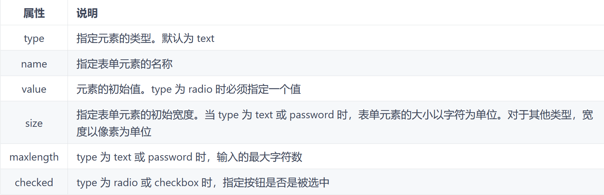

<p style="font-size: 40px; color: #fff"><b>HTML</b></p>

- [README](README.md)
- [CSS | Less](CSS.md)
- [JavaScript.md](JavaScript/JavaScript.md)
- [大杂烩](../../Web/sample.html)

[TOC]

<br><br>

## 关键字缩写


> 参考字典：[HTML 元素参考](https://developer.mozilla.org/zh-CN/docs/Web/HTML/Element)

<br>

## <meta> 文档级元数据元素


## Skipping

## 表单

- **形式：**

  ```html {.line-numbers}
  <form method="" action="">
    <input type="" name="" />
  </form>
  ```

  > `form` 中的 `method` 的 GET 方法通常只用于搜索查询，而不是写入数据

### input

- **定义：**
  | 属性 | 说明 |
  | :-------: | :------- |
  | type | 指定元素的类型。默认为 text |
  | name | 指定表单元素的名称 |
  | value | 元素的初始值。type 为 radio 时必须指定一个值 |
  | size | 指定表单元素的初始宽度。当 type 为 text 或 password 时，表单元素的大小以字符为单位。对于其他类型，宽度以像素为单位 |
  | maxlength | type 为 text 或 password 时，输入的最大字符数 |
  | checked | type 为 radio 或 checkbox 时，指定按钮是否是被选中 |

- **type** 的类型
- 

### button

### select

- 下拉内容
  ```html {.line-numbers}
  <form method="post" action="test.php">
    <span>选一个水果：</span>
    <label for="groups">
      <select id="groups" name="groups">
        <option>Banana</option>
        <option>Cherry</option>
        <option>Lemon</option>
      </select>
    </label>
  </form>
  ```
