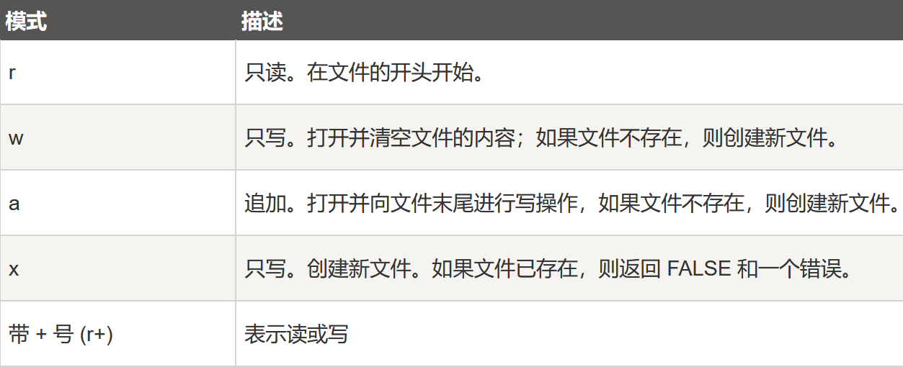

<p style="font-size: 40px; color: #fff"><b>PHP</b></p><br>

- [README](README.md)

[TOC]

## 基础语法

### 一些......

- PHP 是**弱类型语言**，变量类型在运行时确定，所以不需要声明数据类型。且**变量类型是动态**的
- 变量名区分大小写，**但** 函数却不区分大小写。两者还可以相等但不建议
- **输出：**
  - `echo '$d is: ', "$d desu;", EOL` 中，单引号的变量输出变量名，双引号的输出变量值
  - 会输出到终端或浏览器页面上
  - 浏览器的换行只能是 `<br>` 或 `<p>`，终端上的是 `"\n"`

### Array 数组

- PHP 中的 array 实际上是一个**有序映射**。映射是一种把 `values` 关联到 `keys` 的类型。此类型针对多种不同用途进行了优化； 它可以被视为数组、列表（向量）、哈希表（映射的实现）、字典、集合、堆栈、队列等等。

- **定义：** 且 key 值唯一

  ```PHP {.line-numbers}
  // 普通数组
  $a = [1, 2, 3];
  // 字典 map
  $map = [
      key1 => value1, // key 只能是 string 或 int
      key2 => value2  // value 可以是任意类型
  ];
  ```

- 此外 key 会有如下的 **强制转换：**

  - `String` 中包含有效的十进制 `int` ，除非数字前面有一个 + 号，否则将被转换为 int 类型。另外， "08" 不会被强制转换，因为它不是一个有效的十进制整数。
  - `Float` 也会被转换为 `int` ，意味着其小数部分会被舍去。
  - `Bool` 也会被转换成 `int`。
  - `Null` 会被转换为空字符串，即键名 `null` 实际会被储存为 ""。
  - `Array` 和 `object` 不能 被用为键名。坚持这么做会导致警告：Illegal offset type。

- 添加键值可直接用赋值：`$a['new'] = 'mie';`
  删除键值：`unset($a['key']);`，但下标并不会重新分配

- **循环：**

  - 普通 for
    ```php {.line-numbers}
    for ($i = 0; $i < count($a); ++$i){
        echo $i, ": ", $a[$i], EOL;
    }
    ```
  - foreach
    ```php {.line-numbers}
    foreach ($arr as $key => $value) {
        echo $key, ': ', $value, EOL;
    }
    ```

- **排序：**
  - `sort`、`asort`：按值升序
  - `ksort`：按键升序

<br><br>

### 文件操作

- **语法：**

  ```php {.line-numbers}
  $file = fopen('name', 'mode'); // 打开文件
  fclose($file); // 关闭文件
  fgets($file); // 读取行
  fgetc($file); //读取字符
  fwrite($file, $mie); //写入
  feof($file); // 文件尾 (return bool)
  ```

- **读写模式：**
  - 

<br>

## 表单

### 创建表单

- 在 <a href="html.md#表单"><b>HTML</b></a> 中的表单
- **获取：** 且返回的是数组
  ```php {.line-numbers}
  $_POST[name] | $_GET | $_REQUEST // 必须全大写
  ```
- **常见表单元素处理：**
  至于表单元素中的文本框文本域一类的元素，都是直接将元素的 name 属性值作为**键**，用户填写的信息作为**值**，发送到服务端
  - 将 **多选** 或是 **下拉选项** 中将选项返回成数组，则 name 后加上 `[ ]`： `<input name="fish[]">`
  - 防注入的表单验证：
    ```php {.line-numbers}
    function test_input($data): string
    {
        return htmlspecialchars(stripslashes(trim($data)));
    }
    ```
    > `trim`：去除没必要的空格、换行
    > `stripslashes`：去除反斜杠
    > `htmlspecialchars`：转为 HTML 实体符号

### 处理登录


<br>

## 连接 MySQL

### 连接

- 用 **PDO：**
  ```php {.line-numbers}
  $servername = "localhost";
  $username = "root";
  $password = "pw";
  $con = new PDO("mysql:host=$servername;dbname=xx", $username, $password);
  ```
- 用 **MySQLi：**
  ```php {.line-numbers}
  $servername = "localhost";
  $username = "username";
  $password = "password";
  $con = new  mysqli_connect($servername, $username, $password);
  ```

### PDO

###
