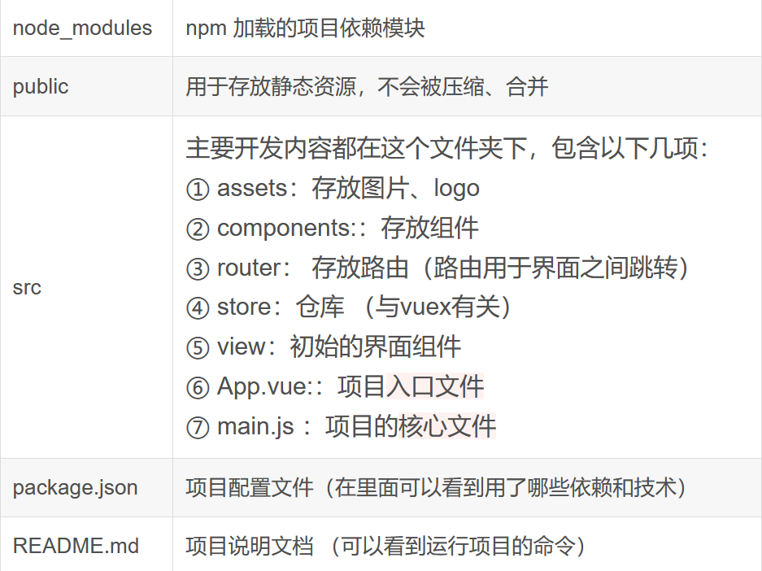

<h1 align="center"><b>Vue.js</b></h1><br>

[TOC]

<br>

## 起步

#### 带脚手架项目文件

- 先安装 `vue-cli` 脚手架
  ```batch {.line-numbers}
  npm install -g @vue/cli
  ```
- 再创建项目
  ```batch {.line-numbers}
  vue create [options] app-name
   rem 运行
  cd app-name
  npm run server
  ```
- 或用 GUI 来创建
  ```batch {.line-numbers}
  vue ui
  ```
- 项目文件结构
- 

#### 仅 Vue.min.js

直接引用文件或是 cdn：`https://unpkg.com/vue@next`

## 基本语法

可以理解为 客户端的 HTML 元素是要先经过服务端渲染(编译) `Vue.js` 后才呈现的，所以客户端并不会显示 Vue 的内容

### 应用

- **创建：**

  ```JavaScript {.line-numbers}
  <div id="app">
    {{}}
  </div>

  const app = {
    data() {
      return {} //返回对象
    },
    // 函数方法
    methods: {},
  }
  Vue.createApp(app).mount('#app') //要挂载的HTML的元素

  //或：
  const app = Vue.createApp({
    data(){
      return {}
    }
  })
  const vm = app.mount('#app');
  ```

  - `data` 选项是一个函数。Vue 在创建新组件实例的过程中调用此函数。它应该**返回一个对象**，然后 Vue 会通过响应性系统将其包裹起来，并以 `$data` 的形式存储在组件实例中。
  - `mount()` 挂载应用：应用实例必须在调用了 `.mount()` 方法后才会渲染出来。该方法接收一个“容器”参数，可以是一个实际的 DOM 元素或是一个 CSS 选择器字符串

- **插值：**
  - **文本插值**：`{{...}}` 标签的内容将会被替代为对应组件实例中 `message` 属性的值，如果 `message` 属性的值发生了改变，`{{...}}` 标签内容也会更新。
