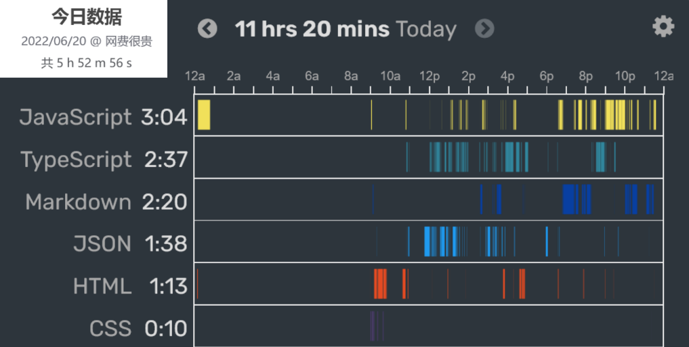

<h1 align="center"><b>What the hell seen today ？</b></h1> 

[TOC]

 

## 22-06

#### 在这之前...

- **文章：**
  [Canvas 资源](https://github.com/chinaBerg/awesome-canvas) &emsp; | [MDN 伪类和伪元素](https://developer.mozilla.org/zh-CN/docs/Learn/CSS/Building_blocks/Selectors/Pseudo-classes_and_pseudo-elements#%E5%8F%82%E8%80%83%E8%8A%82) &emsp;| [隼鸟 2 号：首次发现地外氨基酸？](https://weibo.com/ttarticle/p/show?id=2309404781329462984737)

### 06-20

- **dashboard：**
  - 
- **文章 | 文档：**
  [Axios 文档](https://www.axios-http.cn/) &emsp; | [使用 Typescript 开发 node.js 项目](https://segmentfault.com/a/1190000007574276)&emsp; | [Express 框架 文档](http://expressjs.com/zh-cn/) &emsp;| [用 Node 写一个 APi 接口](https://www.jianshu.com/p/44149ac15b40) &emsp;| [还算可以的 node 文章](https://brucecai55520.gitee.io/bruceblog/notes/nodejs/node.html) &emsp;| [输入 URL 到显示过程发生了什么](https://segmentfault.com/a/1190000013662126) &emsp;
- **社交平台：**
- **其他：**
  - 先是凌晨的 [innei.ren 的毕业](https://innei.ren/notes/123)，看了会 [起码课的 Promise](https://www.bilibili.com/video/av712155832) 的异步，终于是由 [50 个项目的 github 查询](https://50projects50days.com/projects/github-profiles) 补了 `ajax | Axios`
  - 艰难地尝试用 ts 配置 `node` 的工程项目，更多的还是在模块的导入......终于是用 `pnpm i @types/node` 才能在 ts 中使用 `node` 自带模块（import）
  - 然后在 <a href="../../Web/TypeScript/ts-fish/src/index.ts">ts 项目</a> 下，用 `HTTP` 模块整出了个 `API` 服务器，并结合 `axios` 成功地获取到了数据
  - 顺便地在 [起码课的 ExpressJs](https://www.bilibili.com/video/av250818016) 项目中，终于是搞明白了 “路由” 的一些概念，以及 `ExpressJs` 框架的...... 所以，不要跳着来，Vue 之前还得是 node
  - 顺便的一个 node 工具： `pnpm i nodemon`，它将监测文件的改动来刷新项目，就不用每次改动都手动重启项目了

### 06-21

- **dashboard:**
  - VsCode： `3h36m` | FireFox： `4h6m`
- **文章 | 文档**
  [用户代码片段生成器](https://snippet-generator.app/) &emsp; | [JS 注释描述](http://yuri4ever.github.io/jsdoc/) &emsp; | [代码规范](http://alloyteam.github.io/CodeGuide/) &emsp; | [在线的网易云音乐 API 服务器](https://ping-music-api.vercel.app/) &emsp; | 
- **社交平台**
- **其他**
