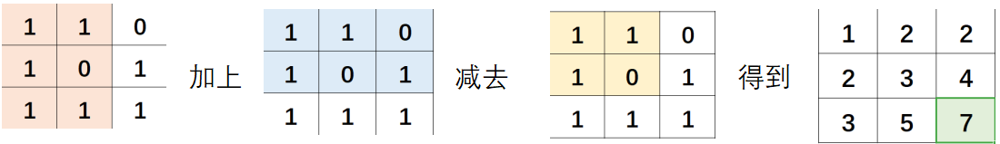

# C / C++

[C++ string](C++%20string/C++%20string.md)

[数据结构](%E6%95%B0%E6%8D%AE%E7%BB%93%E6%9E%84/%E6%95%B0%E6%8D%AE%E7%BB%93%E6%9E%84.md)

[排序](%E6%8E%92%E5%BA%8F/%E6%8E%92%E5%BA%8F.md)

[数学](%E6%95%B0%E5%AD%A6/%E6%95%B0%E5%AD%A6.md)

[搜索](%E6%90%9C%E7%B4%A2/%E6%90%9C%E7%B4%A2.md)

[动态规划DP](%E5%8A%A8%E6%80%81%E8%A7%84%E5%88%92DP/%E5%8A%A8%E6%80%81%E8%A7%84%E5%88%92DP.md)

[我这是遇到了令人不禁直呼喵啊的题目解法啊](%E6%88%91%E8%BF%99%E6%98%AF%E9%81%87%E5%88%B0%E4%BA%86%E4%BB%A4%E4%BA%BA%E4%B8%8D%E7%A6%81%E7%9B%B4%E5%91%BC%E5%96%B5%E5%95%8A%E7%9A%84%E9%A2%98%E7%9B%AE%E8%A7%A3%E6%B3%95%E5%95%8A/%E6%88%91%E8%BF%99%E6%98%AF%E9%81%87%E5%88%B0%E4%BA%86%E4%BB%A4%E4%BA%BA%E4%B8%8D%E7%A6%81%E7%9B%B4%E5%91%BC%E5%96%B5%E5%95%8A%E7%9A%84%E9%A2%98%E7%9B%AE%E8%A7%A3%E6%B3%95%E5%95%8A.md)

------


1. 找规律是吧......递推公式
2. `i++`：用了再加        `++i`：用之前就加了
3. `printf("he said :\"ok.\"");`  输出双引号时要用   \" 句子 \"   括起来
4. `long long `: 9e19,  `unsigned long long` : 1e21
5. 复杂度限制：
	1. 在函数(非递归)中，一维数组大小不超过1e5.
	在全局变量中，一维数组大小不超过1e8，二维数组大小不超过1e4
	2. 对于1s的时间限制，需要保证程序的所有语句的总执行次数不超过1e8.
	
6. 分离数字 **→** i：位数，b：各数字 。  当然，这就得唠唠 **[sprintf](https://www.wolai.com/kUFqERVqpYckYNf2XNU1ik#v6z9SpdLdYT7nZumqmonhY) ** 了
	```C++
	int a[10];   用全局变量来配合void函数，就不用乱return了
	void wei(int n)
	{
	     int T = 1000000000, i = 0, f = 0;
	    while (T)
	    {
	        if (n >= T)
	            f = 1;
	        if (f)
	            a[i++] = n / T, n %= T;
	        T /= 10;
	    }
	}
	int main()
	{
	    int n = 1234567890;
	    wei(n);
	    for (int i = 0; i < 10; i++)
	        cout << a[i] << " ";
	}
	```
	
7. `scanf("%4d%4d",&a,&b);`输入12345678将把1234赋予a，而把5678赋予b
8. 让循环里的if只判断一次：
	```C++
	bool f = 1;
	for( ... )
	 if (xxx && f) {
	     xxx, f = 0;
	    }
	```
	
9. 随机数生成 `int num = rand() % 50 + 1; //产生一个1-50之间的数`  带 ` <stdlib.h>`头
10. `const void *a` 因此，void * 类型指针，这个类型指针指向了实实在在的存放数据的地址，但是该地址存放的数据的 **数据类型** 我们暂时不知道。
11. oj上结尾无空格：
	```C++
	if (i > 0)   cout << ' ';   //这里的for循环从i=0 开始
	else         cout << xxx;
	或者，令 f=0 ， if (f = = 1)  cout << " ";  符合条件时在答案前输出空格
	                cout << i;
	                f = 1;
	```
	
12. **`double`** 的位数高达 **`-1.79E+308 ~ +1.79E+308`**
13. **二维数组** ：按坐标表示，xy轴互换
	```C++
	    cin >> y >> x;
	    int map[x][y];
	    for (i = 1; i <= n; i++)
	        for (j = 1; j <= n; j++)
	            map[i][j] = xxx;
	            ...
	    cout << map[x][y];
	    
	像是轰炸范围: 
	            起始位置              末位置（边界）
	               ↓                     ↓
	for (i = max(y1 - f, 0); i <= min(y1 + f, y); i++)
	            for (j = max(x1 - f, 0); j <= min(x1 + f, x); j++)
	
	```
	
14. 计数数组
	       其实就是，将输入的值当做数组的位置下标    —> 桶
	```C++
	const int N = 100;
	int f[N];
	int main(){
	    int n, m, i;
	    cin >> n;
	    while (n--) {
	        cin >> m;
	        f[m]++;
	    }
	    for (i = 0; i < N; i++) {
	        if (f[i] != 0)
	            cout << i << ": " << f[i] << "次" << endl;
	    }
	    return 0;
	}
	```
	
15. 去重
	纯数字的去重——**[转string后再转回数字](https://www.wolai.com/kUFqERVqpYckYNf2XNU1ik#usaSP5VLyCg4GBR35nq1Gt)**
	```C++
	数组去重——数组放全局
	int uniquee(int c[], int n)
	{
	    bool f[n] = {false};
	    for (i = 0; i < n; i++)
	        if (!f[i])  //跳过已经标记过的
	            for (j = i + 1; j < n; j++)
	                if (c[i] == c[j])
	                    f[j] = 1;  //标记重复的 的位置
	    for (i = k = 0; i < n; i++)
	        if (!f[i])
	            c[k++] = c[i];
	    return k;   //k 为去重后的长度
	}
	```
	
16. 结构体数组：用一维数组**代替**多维数组
	```C++
	struct pan
	{
	    double x, y, z;   相当于定义了一个三维数组
	} a[51];
	
	for (i = 0; i < n; i++)
	        cin >> a[i].x >> a[i].y >> a[i].z;  输入
	
	
	bool cmp(pan x, pan y){
	    return x.z < y.z;    以pan中的z小到大排序
	}
	sort(a , a + n, cmp);    排序, cmp：排序规则
	```
	
17. 与其用else if 一个个地判断，还不如用数组来打表 / 枚举
	```C++
	像是 int day[] = {31,28,31,30,31,30,31,31,30,31,30,31);
	void函数 →  if(是闰年)  day[1] = 29;
	
	```
	
18. 知道递推公式，f (n) = f ( n+1 ) + f  ( n+2 )，可以直接套   —> 不是模拟，可以暴力但爆，手动推一下递推公式
	```C++
	for (int i = 0; i <= size; i++)                     ↑也就是说，只注重结果而不是过程
	    {
	        if (i > 1)
	            arr[i] = arr[i - 2] + arr[i - 1]; //递推算法
	        printf("factorial[%d]=%d\n", i, arr[i]);
	    }
	```
	
19. C++11 新特性：
	```C++
	int a[10] = {0};
	    for (int &c : a)   要改变值时要加 & ，不然只是 只读 模式
	        c++;
	    for (int i : a)
	        cout << a[i] << " ";
	        
	string s;
	for (char c : s)
	    cout << c;
	
	```
	
20. 梯形数字：    要想一下，多个for循环是 **嵌套关系** 还是 **并列关系**
	```C++
	for (t = 1, j = 1; j <= n; j++)           //         01
	    {                                     //       0203
	        for (k = 0; k < n - j; k++)       //     040506
	            printf("  ");                 //   07080910
	        for (; k < n; k++, t++)
	            printf("%02d", t);
	        printf("\n");
	    }
	```
	
21. **前缀和** ： 还可以求区间内的和
	```C++
	for (i = 1; i <= n; i++){
	        cin >> a[i];
	        sum[i] = sum[i - 1] + a[i];
	    }
	```
	
	二维数组：
	
	```C++
	for (i = 1; i <= n; i++)  //打表
	        for (j = 1; j <= m; j++) {
	            cin >> mpa[i][j];
	            sum[i][j] = mpa[i][j] + sum[i - 1][j] + sum[i][j - 1] - sum[i - 1][j - 1];
	        }
	```
	
	
	```C++
	 cin >> x1 >> y1 >> x2 >> y2;   //求表
	    cout << sum[x2][y2] - sum[x1 - 1][y2] - sum[x2][y1 - 1] + sum[x1 - 1][y1 - 1];
	```
	
22. 数组的最大值：
	```C++
	    int p[5] = {3, 4, 5333, 2, 3};
	    int pos = *max_element(p, p + 5);
	```
	
23. s
	```C++
	    int a[5] = { 1,2,3,4,5 };
	    //从 a 数组中找到第一个不小于 3 的元素
	    int *p = lower_bound(a, a + 5, 3);  必须是已经排好序的数组
	    cout << "*p = " << *p << endl;
	```
	
24. 否命题原理 ：**`if (c != 'a' && c != 'b')`** 两个不等于用and，等于用or
25. 相同情况循环了n次的周期，那只要将结果乘以n再加上周期以外的就行
26. 定义无穷大：int a = INT_MAX;
27. 找最大值不一定要排序数组，用一下比较
	```C++
	int maxx = INT_MIN;
	for(...)
	{
	    ...
	    maxx = max(maxx, a[i]);
	}
	
	```
	
28. 方向数组：用数组来控制方向                    —>注意，用fang（i，j ）时，数组要从1开始
	```C++
	void fang8(int x, int y)  //8个方向  九宫格中心的四周
	{
	    int spy[] = {0, 1, 0, -1, 1, 1, -1, -1};
	    int spx[] = {1, 0, -1, 0, -1, 1, 1, -1};
	    for (int i = 0; i < 8; ++i)
	    {
	        int nx = x + spx[i];
	        int ny = y + spy[i];
	        if (......)
	            ......;
	    }
	}
	
	```
	
	```C++
	void fang4(int x, int y)  //4个方向 上下左右
	{
	    int dxy[4][2] = {{1, 0}, {-1, 0}, {0, 1}, {0, -1}};
	    for (int i = 0; i < 4; i++)
	    {
	        int nx = x + dxy[i][0];
	        int ny = y + dxy[i][1];
	        if(......)
	            ......;
	    }
	}
	```
	
29. 让函数return数组：
	```C++
	int *xxx(int a[])
	{
	    ......
	    return a;
	}
	int main()
	{
	    int a[10];
	    int *b = xxx(a);   -->指针也就是数组，int len = sizeof(b)/sizeof(int); 得数组b的长度
	}
	```
	
30. memset 批量赋值只能是char用，int只能给-1 或0， 而：
	```C++
	赋值无穷大：memset(a, 127, sizeof(a))
	赋值无穷小：memset(a, 128, sizeof(a))
	```
	
31. 


