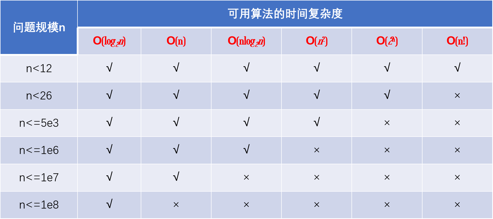
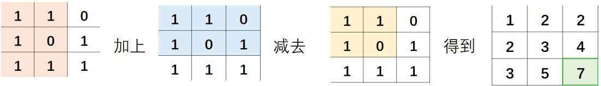

# C / C++

- **[C++ string](String.md)**
- **[数据结构(STL)](DataStructure.md)**
- **[排序](Sort.md)**
- **[数学](Math.md)**
- **[搜索](Search.md)**
- **[动态规划 DP](DP.md)**
- **[喵啊](miao.md)**

</br> </br>

1.  命名规范：**[编程语言中常用的变量命名缩写](https://blog.csdn.net/qq_37851620/article/details/94731227)**

2.  **[C++ cin 详解及清空输入缓冲区](https://blog.csdn.net/selina8921/article/details/79067941)**

3.  快读快写：

    ```C++ {.line-numbers}
    void write(int n)
    {
        if (n < 0) putchar('-'), n = -n;
        if (n > 9) write(n / 10);
        putchar(n % 10 + '0');
    }

    int read()
    {
        int x = 0, f = 1;
        char c = getchar();
        while (!isdigit(c)){
            if (c == '-') f = -1;
            c = getchar();
        }
        while (isdigit(c))
            x = x * 10 + c - '0', c = getchar();
        return x * f;
    }
    ```

4.  **[C++ stringstream 介绍](https://www.cnblogs.com/wuchanming/p/3906176.html)**

5.  **[C++模板 template 用法总结](https://blog.csdn.net/qq_35637562/article/details/55194097)**

    ```C++ {.line-numbers}
    template <class T>
    T big(T x, T y)
    {
        return x > y ? x : y;
    }
    ```

    ```C++ {.line-numbers}
    template <class out_type, class in_value>
    out_type transf(const in_value &t)
    {
       stringstream stream; out_type result;
       stream << t, stream >> result, stream.sync();
       return result;
    }
    int main()
    {
       string s = "532";
       double t = transf<double>(s); // <>里的是要转换的类型名，()里的是被转换的变量名
    }
    ```

6.  `i++`：用了再加 `++i`：用之前就加了

7.  `printf("he said :\"ok.\"");` 输出双引号时要用 \" 句子 \" 括起来

8.  `long long`: 9e19, `unsigned long long` : 1e21

9.  复杂度限制：
10. 在函数(非递归)中，一维数组大小不超过 1e5.
    在全局变量中，一维数组大小不超过 1e8，二维数组大小不超过 1e4
11. 对于 1s 的时间限制，需要保证程序的所有语句的总执行次数不超过 1e8.
    

12. `scanf("%4d%4d",&a,&b);`输入 12345678 将把 1234 赋予 a，而把 5678 赋予 b

13. 让循环里的 if 只判断一次：

    ```C++ {.line-numbers}
    bool f = 1;
    for( ... )
     if (xxx && f) {
         xxx, f = 0;
        }
    ```

14. 随机数生成 `int num = rand() % 50 + 1; //产生一个1-50之间的数` 带 `<stdlib.h>`头

15. `const void *a` 因此，void \* 类型指针，这个类型指针指向了实实在在的存放数据的地址，但是该地址存放的数据的 **数据类型** 我们暂时不知道。

16. **`double`** 的位数高达 **`-1.79E+308 ~ +1.79E+308`**

17. 二维数组

    ```C++ {.line-numbers}
        cin >> y >> x;
        int map[x][y];
        for (i = 1; i <= n; i++)
            for (j = 1; j <= n; j++)
                map[i][j] = xxx;
                ...
        cout << map[x][y];

    像是轰炸范围:
                起始位置              末位置（边界）
                   ↓                     ↓
    for (i = max(y1 - f, 0); i <= min(y1 + f, y); i++)
                for (j = max(x1 - f, 0); j <= min(x1 + f, x); j++)
    ```

18. 计数数组 其实就是，将输入的值当做数组的位置下标 `—>` 桶

    ```C++ {.line-numbers}
    const int N = 100;
    int f[N];
    int main(){
        int n, m, i;
        cin >> n;
        while (n--) {
            cin >> m;
            f[m]++;
        }
        for (i = 0; i < N; i++) {
            if (f[i] != 0)
                cout << i << ": " << f[i] << "次" << endl;
        }
        return 0;
    }
    ```

19. 去重

    ```C++ {.line-numbers}
    数组去重——数组放全局
    int uniquee(int c[], int n)
    {
        bool f[n] = {false};
        for (i = 0; i < n; i++)
            if (!f[i])  //跳过已经标记过的
                for (j = i + 1; j < n; j++)
                    if (c[i] == c[j])
                        f[j] = 1;  //标记重复的 的位置
        for (i = k = 0; i < n; i++)
            if (!f[i])
                c[k++] = c[i];
        return k;   //k 为去重后的长度
    }
    ```

20. 结构体数组：用一维数组**代替**多维数组

    ```C++ {.line-numbers}
    struct pan
    {
        double x, y, z;   相当于定义了一个三维数组
    } a[51];

    for (i = 0; i < n; i++)
            cin >> a[i].x >> a[i].y >> a[i].z;  输入

    bool cmp(pan x, pan y){
        return x.z < y.z;    以pan中的z小到大排序
    }
    sort(a , a + n, cmp);    排序, cmp：排序规则
    ```

21. 与其用 else if 一个个地判断，还不如用数组来打表 / 枚举

    ```C++ {.line-numbers}
    像是 int day[] = {31,28,31,30,31,30,31,31,30,31,30,31);
    void函数 →  if(是闰年)  day[1] = 29;
    ```

22. 知道递推公式，f (n) = f ( n+1 ) + f ( n+2 )，可以直接套 —> 不是模拟，可以暴力但爆，手动推一下递推公式

    ```C++ {.line-numbers}
    for (int i = 0; i <= size; i++)                     ↑也就是说，只注重结果而不是过程
        {
            if (i > 1)
                arr[i] = arr[i - 2] + arr[i - 1]; //递推算法
            printf("factorial[%d]=%d\n", i, arr[i]);
        }
    ```

23. C++11 新特性：

    ```C++ {.line-numbers}
    int a[10] = {0};
    for (int &c : a)   要改变值时要加 & ，不然只是 只读 模式
        c++;
    for (int i : a)
        cout << a[i] << " ";

    string s;
    for (char c : s)
        cout << c;
    ```

24. 梯形数字： 要想一下，多个 for 循环是 **嵌套关系** 还是 **并列关系**

    ```C++ {.line-numbers}
    for (t = 1, j = 1; j <= n; j++)           //         01
        {                                     //       0203
            for (k = 0; k < n - j; k++)       //     040506
                printf("  ");                 //   07080910
            for (; k < n; k++, t++)
                printf("%02d", t);
            printf("\n");
        }
    ```

25. **前缀和** ： 还可以求区间内的和

    - 一维：
      ```C++ {.line-numbers}
      for (i = 1; i <= n; i++){
              cin >> a[i];
              sum[i] = sum[i - 1] + a[i];
          }
      ```
    - 差分：如给数组 `[l, r]` 之间加上 c

      ```C++{.line-numbers}
      int n, m;
      scanf("%d%d", &n, &m);
      for (int i = 1; i <= n; i++)
      {
          scanf("%d", &a[i]);
          b[i] = a[i] - a[i - 1]; //构建差分数组
      }
      int l, r, c;
      while (m--)
      {
          scanf("%d%d%d", &l, &r, &c);
          b[l] += c, b[r + 1] -= c;
      }
      for (int i = 1; i <= n; i++)
      {
          b[i] += b[i - 1]; //求前缀和运算
          printf("%d ", b[i]);
      }
      ```

    - 二维：
      

      ```C++ {.line-numbers}
      for (i = 1; i <= n; i++)  //打表
            for (j = 1; j <= m; j++) {
                cin >> mpa[i][j];
                sum[i][j] = mpa[i][j] + sum[i - 1][j] + sum[i][j - 1] - sum[i - 1][j - 1];
            }
      ```

    - 还原：
      

      ```C++ {.line-numbers}
      cin >> x1 >> y1 >> x2 >> y2;   //求表
      cout << sum[x2][y2] - sum[x1 - 1][y2] - sum[x2][y1 - 1] + sum[x1 - 1][y1 - 1];
      ```

26. 数组的最大值：

    ```C++ {.line-numbers}
        int p[5] = {3, 4, 5333, 2, 3};
        int pos = *max_element(p, p + 5);
    ```

27. 否命题原理 ：**`if (c != 'a' && c != 'b')`** 两个不等于用 and，等于用 or

28. 相同情况循环了 n 次的周期，那只要将结果乘以 n 再加上周期以外的就行

29. 定义无穷大：`int a = INT_MAX;`

30. 找最大值不一定要排序数组，用一下比较

    ```C++ {.line-numbers}
    int maxx = INT_MIN;
    for(...)
    {
        ...
        maxx = max(maxx, a[i]);
    }
    ```

31. 方向数组：用数组来控制方向 —>注意，用 fang（i，j ）时，数组要从 1 开始

    ```C++ {.line-numbers}
    void fang8(int x, int y)  //8个方向  九宫格中心的四周
    {
        int spy[] = {0, 1, 0, -1, 1, 1, -1, -1};
        int spx[] = {1, 0, -1, 0, -1, 1, 1, -1};
        for (int i = 0; i < 8; ++i)
        {
            int nx = x + spx[i];
            int ny = y + spy[i];
            if (......)
                ......;
        }
    }
    ```

    ```C++ {.line-numbers}
    void fang4(int x, int y)  //4个方向 上下左右
    {
        int dxy[4][2] = {{1, 0}, {-1, 0}, {0, 1}, {0, -1}};
        for (int i = 0; i < 4; i++)
        {
            int nx = x + dxy[i][0];
            int ny = y + dxy[i][1];
            if(......)
                ......;
        }
    }
    ```

32. 让函数 return 数组：

    ```C++ {.line-numbers}
    int *xxx(int a[])
    {
        ......
        return a;
    }
    int main()
    {
        int a[10];
        int *b = xxx(a);
    -->指针也就是数组，int len = sizeof(b)/sizeof(int); 得数组b的长度
    }
    ```

33. memset 批量赋值只能是 char 用，int 只能给-1 或 0， 而：

    ```C++ {.line-numbers}
    赋值无穷大：memset(a, 127, sizeof(a))
    赋值无穷小：memset(a, 128, sizeof(a))
    ```

34.
