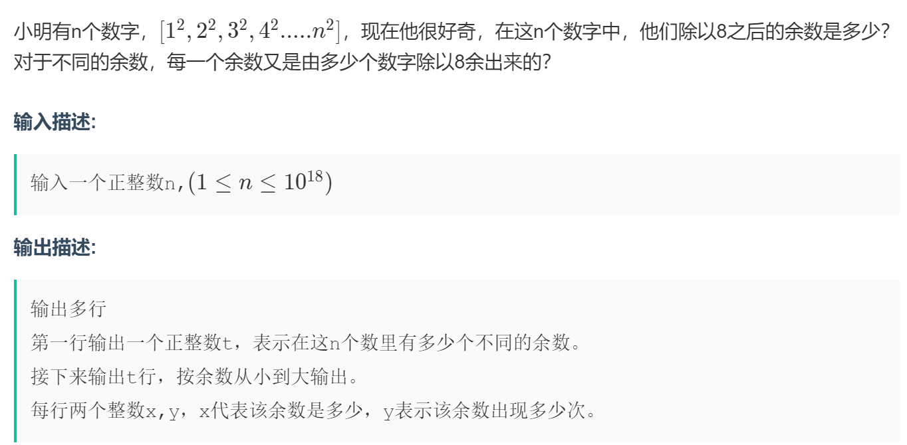

# 喵 啊

## **目 录**

- [首页](main.md)

1. [周期循环 --> 打表](#t1)
2. [拼接数字取模%!](#t2)

<br><br>

<a id = "t1"> </a>

1. **[周期循环 --> 打表](https://ac.nowcoder.com/acm/contest/22672/B)**

   

   ```C++ {.line-numbers}
   #include <bits/stdc++.h>
   using namespace std;
   typedef long long ll;

   int main()
   {
       ll n, quan, yu;
       ll a[5] = {0};   //实际上余数就只有0 1 4 三种情况
       ll num[5] = {-1, 1, 4, 1, 0};  //余数的周期是4 ： 1 4 1 0

       cin >> n;
       quan = n / 4, yu = n % 4;
       a[0] = quan, a[1] = quan * 2, a[4] = quan;

       for (ll i = 1; i <= yu; i++) //周期之外
           a[num[i]]++;

       ll hv = (a[0] != 0) + (a[1] != 0) + (a[4] != 0);
       cout << hv << "\n";

       for (ll i = 0; i <= 4; i++)
           if (a[i] != 0)
               cout << i << " " << a[i] << "\n";
   }
   ```

<br> <a id = "t2"> </a>

2. **[拼接数字取模%!](https://ac.nowcoder.com/acm/contest/23846/D)**

   

   ```C++ {.line-numbers}
   int n, t;
   signed main()
   {
       for (cin >> t; t--;)
       {
           cin >> n;
           int x = 0, ans = 0;
           for (int i = 1; i <= n; i++)
           {
               x = stoi(to_string(x) + to_string(i)) % 7;
               ans += !x;
           }
           cout << ans << endl;
       }
   }
   ```
